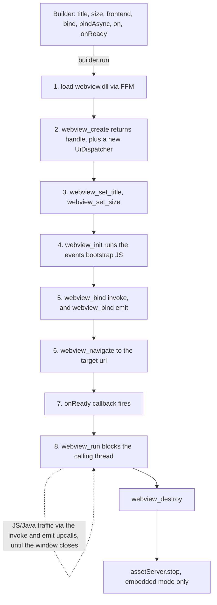
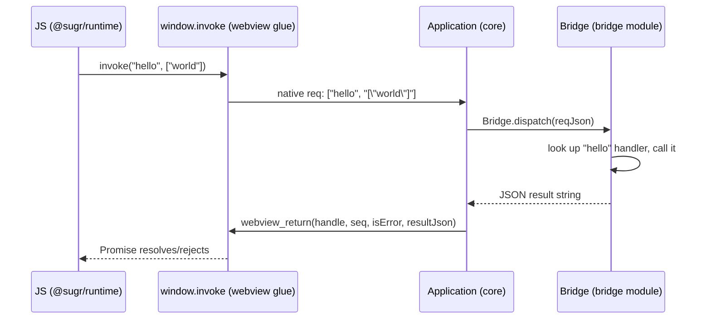

# How it works

sugr has two technical problems to solve, and everything else builds on top:
**calling native C functions from Java without JNI**, and **compiling the
whole thing to a small standalone binary**.

## FFM instead of JNI

sugr's `core` module binds directly to the OS's native webview library
(`libwebview` - itself a thin wrapper over WebView2/WKWebView/WebKitGTK)
using the [Foreign Function & Memory API](https://openjdk.org/jeps/454)
(`java.lang.foreign`), not JNI. No C glue code to compile per platform -
`Linker.downcallHandle()` binds directly to exported C functions
(`webview_create`, `webview_navigate`, `webview_bind`, ...), and
`Linker.upcallStub()` lets native code call back into Java (used for the
`invoke`/`emit` bindings, and for `sqlite3_exec`'s row callback in the
`examples/sql-client` app).

## Application lifecycle

`Application.builder()` only collects configuration - `title()`, `size()`,
`frontend()`, `bind()`/`bindAsync()`, `on()`, `onReady()` all just populate a
`Builder`. Nothing native happens until `builder.run()`:

1. **Load the native lib.** Extract the bundled `webview.dll`/`.so`/`.dylib`
   from the classpath to a temp file, bind its exported functions via FFM
   (`NativeLibrary`).
2. **Create the window.** `webview_create` returns a handle; a `UiDispatcher`
   is built around it (from this point, sugr knows which thread is "the UI
   thread" for the rest of the run).
3. **Configure it.** `webview_set_title`, `webview_set_size`.
4. **Inject the events bootstrap.** `webview_init` runs a small script
   (`window.__sugrEvents__`, an event emitter) before *any* page loads,
   including the very first navigation.
5. **Bind the two fixed upcalls.** `"invoke"` (JS calls into Java - see
   [The bridge protocol](#the-bridge-protocol) below) and `"emit"` (JS→Java
   events). This is the *entire* JS↔Java surface - every `@Bind` method and
   every hand-written `bind()` call goes through the same `"invoke"` binding.
6. **Navigate.** To the dev server URL (`sugr dev`, real HMR) or to the
   embedded `AssetServer`'s local base URL (`sugr build`'s production path) -
   see [Window & frontend](/guide/window).
7. **Fire `onReady(this)`.** The one point where your code gets the
   `Application` handle before the event loop starts - stash it if
   background code needs to call `emit()` later.
8. **Block on the event loop.** `webview_run` blocks the calling thread until
   the window closes. This is why `run()` must be called from your app's
   main thread and nowhere else.

While the loop runs, everything is event-driven, not sequential - see
[The bridge protocol](#the-bridge-protocol) for the `invoke`/`emit` upcalls
and [Thread model](#thread-model) for how replies/events hop back onto the UI
thread from other threads.

**Shutdown:** `webview_run` returns once the user closes the window →
`webview_destroy` → the embedded `AssetServer` (if any) is stopped. There's
currently no app-level "before close" hook - closing the window ends
`run()` with no further extension point.

## The bridge protocol

JS never calls arbitrary native functions - there's exactly one entry point,
`window.invoke(method, paramsJson)`, injected by a single `webview_bind` call
in `Application.run()`. Every `@Bind`-generated or hand-written binding goes
through it:

`Bridge` doesn't know about webview at all - `Application` (in `core`) owns
the FFM calls and the JSON-RPC-shaped envelope; `Bridge` just routes a method
name to a handler and returns JSON text. This is why hand-written `bind()`
calls and `@Bind`-generated ones can freely mix: they're both just entries in
the same `Bridge` handler map.

Events (`events.emit()`/`events.on()`) are a second, parallel channel -
`webview_bind("emit", ...)` for JS→Java, and a JS-side `__sugrEvents__`
dispatcher (injected once via `webview_init`, before any page loads) for
Java→JS, driven by `Application.emit()` calling `webview_eval`.

## Thread model

`webview_create` + `webview_run` must run on the same thread (the OS's UI
thread - on macOS specifically the *main* thread). Any native call from a
different thread has to go through `webview_dispatch`, which schedules a
callback back onto the UI thread. `Application.emit()` always does this,
which is why it's safe to call from anywhere. Bind/invoke replies go through
the same `UiDispatcher` path (`Application.reply()`), which runs inline if
already on the UI thread or hops via `webview_dispatch` otherwise - this
works reliably regardless of which thread completes the bind's
`CompletableFuture`, since the webview request id is copied to a Java
`String` synchronously before any async work starts (see `reply()`'s
javadoc for why that copy matters).

## No reflection at the bind boundary

`@Bind` methods are dispatched via a **generated** switch-shaped class - the
`processor` module reads your method's signature at compile time (via
`javax.annotation.processing`, not runtime reflection) and emits direct calls
(`target.hello(arg0)`), plus JSON encode/decode calls into `bridge.Json` for
whatever the parameter/return types need (records, `List`, `Map`,
`CompletableFuture`). Nothing about the bind path needs a
`reachability-metadata.json` entry for native-image - the FFM downcalls in
`core` still do (that's inherent to FFM, not something `@Bind` can remove),
but you generate that once with `native-image-agent` and it doesn't grow as
you add more `@Bind` methods.

## Native-image

GraalVM's `native-image` does closed-world, whole-program static analysis
and compiles straight to a native binary - no JVM at runtime, no JIT
warm-up, much lower baseline memory than running the same app on a JVM (this
is also *why* native-image builds take longer than a `javac` compile and why
`sugr dev` intentionally runs on a plain JVM rather than rebuilding a native
image on every save - see [Building & packaging](/guide/build)).
